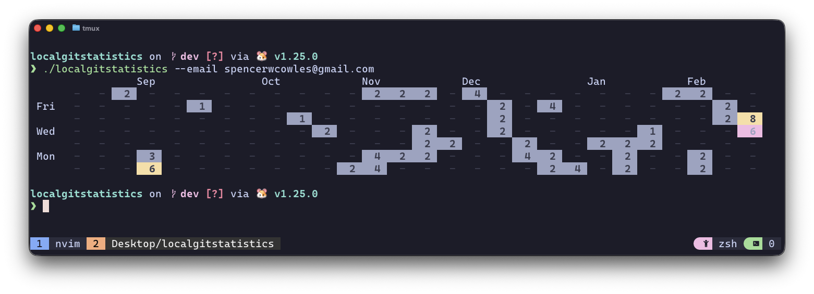

# 📦 Local Git Statistics




> *Visualize your local git contributions in a beautiful terminal graph.*

---

## 🌟 Highlights

-   **Visualize**: Generate a GitHub-style contribution graph in your terminal.
-   **Local**: Scans your local directories for git repositories.
-   **Privacy-Focused**: Runs entirely locally, no data is sent to external servers.
-   **Fast**: recursively scans directories efficiently. This tool is built with Go.

## ℹ️ Overview

**Local Git Statistics** is a CLI tool that scans your local directories for git repositories and generates a contribution graph based on your commit history. It's designed to give you insights into your coding activity across all your local projects, regardless of whether they are pushed to a remote server or not.

By analyzing the `.git` folders on your machine, it constructs a heatmap of your commits over the last 6 months, helping you track your productivity and coding streaks.

### ✍️ Authors

-   [Spencer Cowles](https://github.com/spencerwcowles)

## 🚀 Usage

### 1. Install the project

```bash
go install
```

This will install the executable to your GOPATH bin directory. make sure your GOPATH bin is in your PATH.

### 2. Scan for repositories

Recursively scan a folder to add git repositories to the stats database.

```bash
localgitstatistics -add /path/to/your/codebase
```

*Example:*
```bash
localgitstatistics -add /Users/spencercowles/dev
```

### 3. Generate Statistics

Generate the contribution graph for a specific email address.

```bash
localgitstatistics -email your@email.com
```

*Example:*
```bash
localgitstatistics -email spencer@example.com
```

## ⬇️ Installation

### Prerequisites

-   [Go](https://go.dev/doc/install) installed on your machine.

### Steps

1.  Clone the repository:
    ```bash
    git clone https://github.com/spencerwcowles/localgitstatistics.git
    ```
2.  Navigate to the project directory:
    ```bash
    cd localgitstatistics
    ```
3.  Install the application:
    ```bash
    go install
    ```

## 🧪 Testing

This project includes unit tests to ensure reliability. You can run them using the following command:

```bash
go test ./...
```

## 💭 Feedback and Contributing

If you find a bug or have a feature request, please [open an issue](https://github.com/spencerwcowles/localgitstatistics/issues).

Contributions are welcome! Feel free to fork the repository and submit a pull request.